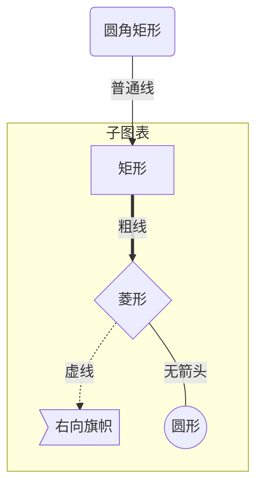
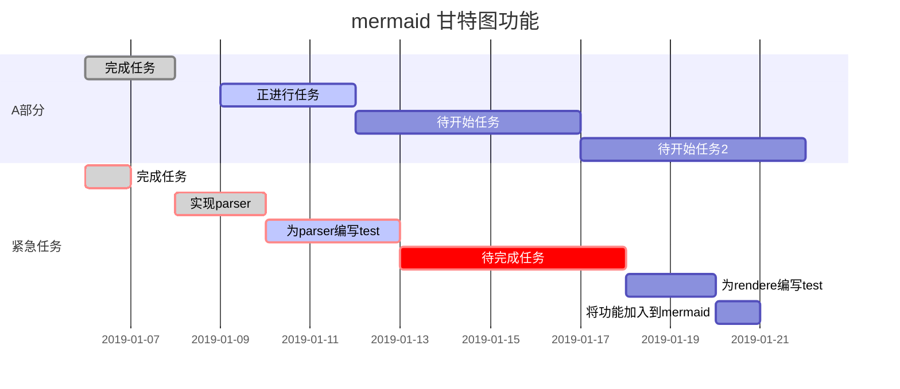
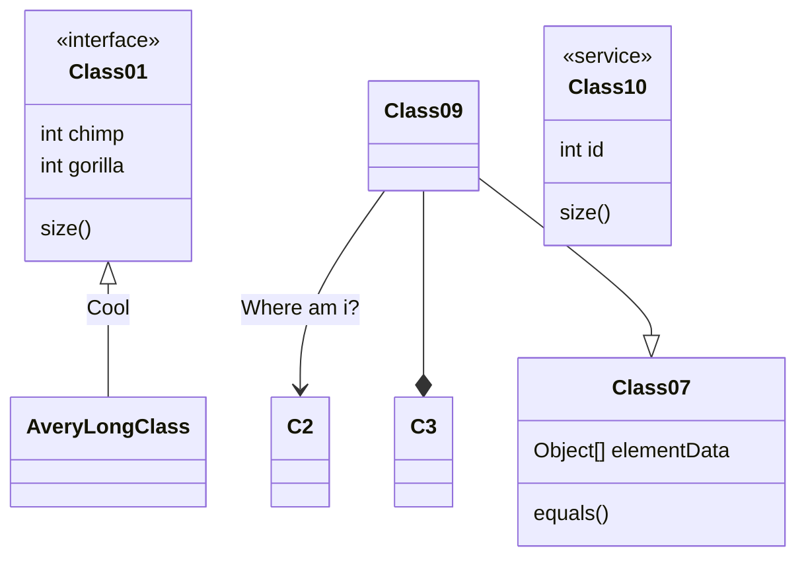
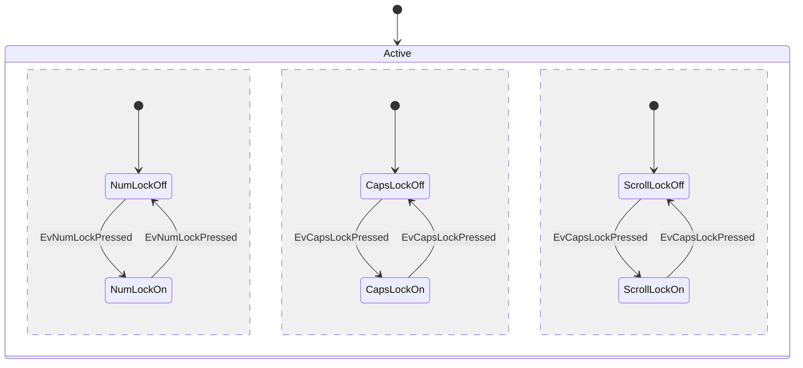
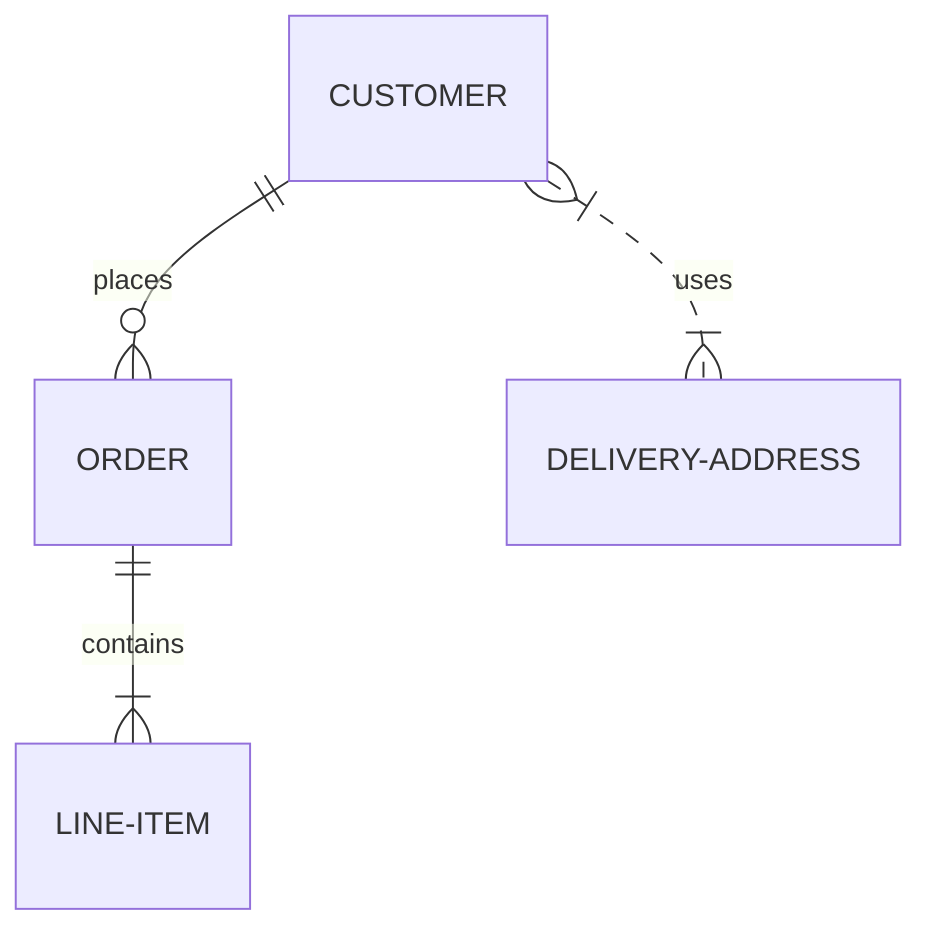
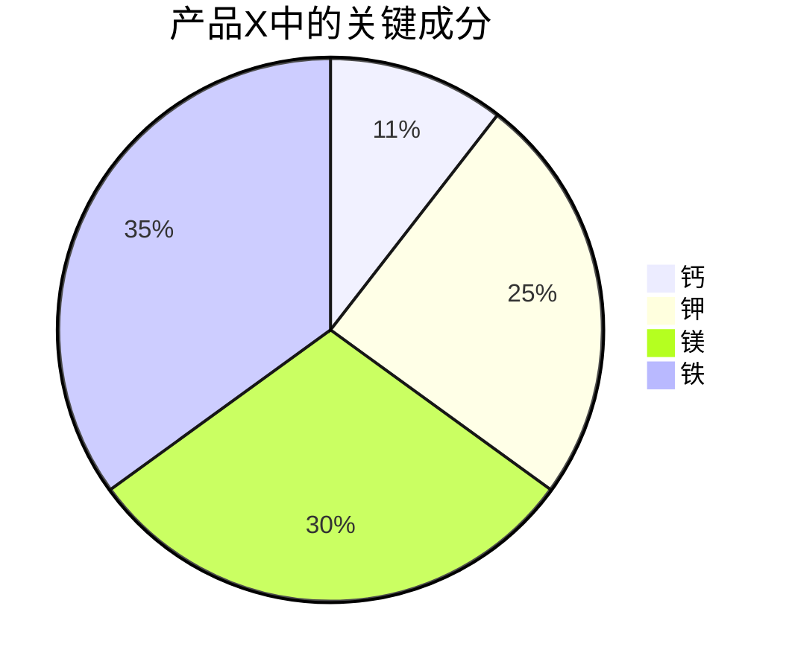

# 图表组件

- [示例文档](https://github.com/mermaid-js/mermaid/tree/develop/docs)
- [mermaid-live-editor 在线编辑器](https://mermaidjs.github.io/mermaid-live-editor/)
- [github 语法示例](https://mermaid-js.github.io/mermaid/#/)

当撰写文档的时候，需要使用绘制流程图。 Mermaid.js 可以看成是 Markdown 文档中一款绘图插件，其语法完全是 markdownish 的，可以直接呈现图形与在线实时编辑。

## VSCode 流程图兼容

安装以下插件，可实现项目编辑与发布一致性

- Markdown Preview Enhanced
- Mermaid Markdown Syntax Highlighting

## markdown 画图

- 代码头部加标签 `mermaid`,会转为绘图组件显示。

- 代码第一行为以下类型，也会转为绘图组件显示。
  `['gitGraph', 'classDiagram', 'sequenceDiagram', 'gantt']`

## 流程图 graph

## 甘特图 gantt

## 类别图 classDiagram

## 状态图 stateDiagram

## 实体关系图 erDiagram

## 饼图

-[pie.md](https://github.com/mermaid-js/mermaid/blob/develop/docs/pie.md)

