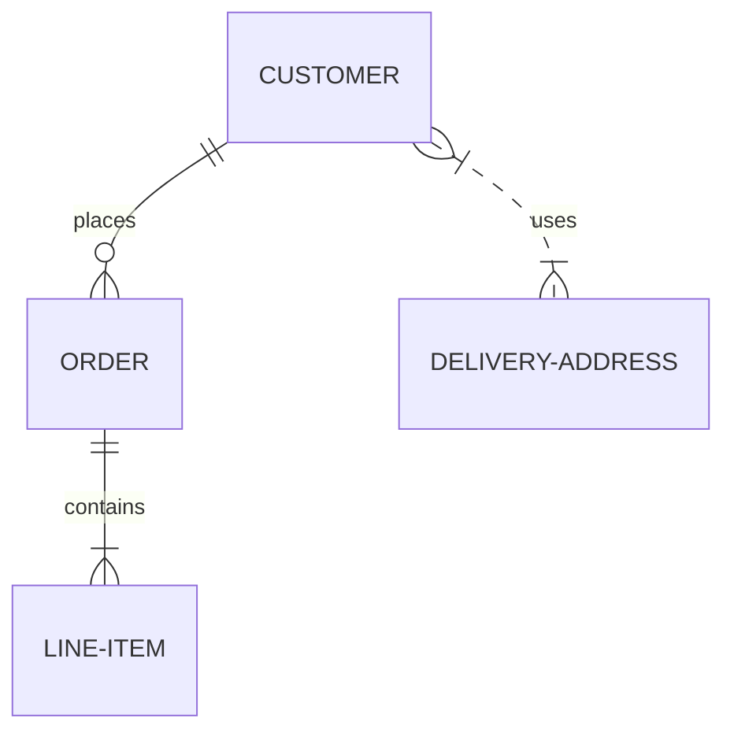

# vitepress 插件

支持站内搜索,markdown 中运行 vue3 组件，与画的时序图，图表组件，可在线实时编辑

- [VSCode 开发工具及其插件](../guide/vscode.md)
- [vitepress 官方文档](./vitepress.md)
- [quick-plugin-md 插件](https://www.npmjs.com/package/quick-plugin-md)
- [markdown-it](https://markdown-it.docschina.org/)
- [mermaid 图表插件](https://mermaid-js.github.io/)

## vitepress 快速使用

- 下载开箱即用文档模板
  [vitepress-template ](https://gitee.com/qve/vitepress-template)

- 解压到文件夹，在终端中执行

```sh
# 安装

yarn

## 测试

yarn docs:dev

## 打包

yarn docs:build
```

::: warning 特别注意
首次运行测试有可能会报路径错误，请多刷新几次，即可正常运行。
:::

## quick-plugin-md 组件

- [x] `CodeRun` 代码执行组件
- [x] `SearchBar` 搜索组件
- [x] `Mermaid` 流程图组件
- [x] `Picture` 图片组件
- [ ] 支持 i18n 多国语言

## 目录结构

可以使用目录生成插件

```js
|-- project               项目根目录
    |-- index.md          首页
    |-- keywords.json     搜索数据源，根据文档自动生成
    |-- package.json      配置文件
    |-- docs              文档目录
        |-- index.md         文档首页
        |-- .vitepress       插件目录
        |   |-- config.js    插件配置文件
        |   |-- plus.js      外挂插件配置文件，路径配置
        |   |-- theme             自定义主题
        |       |-- index.js      启动
        |       |-- Layout.vue    搜索主题定义
        |       |-- startup.js    组件加载
        |       |-- vue.api.js    vue 组件配置
        |-- public          公共文件夹
        |   |-- favicon.ico
        |   |-- fonts       阿里字体文件，iconfont
        |   |   |-- demo.css
        |   |   |-- demo_index.html
        |   |   |-- iconfont.css
        |   |   |-- iconfont.eot
        |   |   |-- iconfont.js
        |   |   |-- iconfont.json
        |   |   |-- iconfont.svg
        |   |   |-- iconfont.ttf
        |   |   |-- iconfont.woff
        |   |   |-- iconfont.woff2
```

## vitepress config 配置 

- [配置文档](https://vitepress.vuejs.org/guide/global-computed.html)

> .vitepress>config.js

```js
module.exports = {
  base: '/',
  title: 'Quick 文档 ' + version,
  description: 'quick net core 项目开发库',
  alias: {
    '@': root.path,
    vue: 'vue/dist/vue.esm-bundler.js',
  },
   // 头部引入第三方流程图脚本
  // head: [['script', { type: 'module', src: root.base + '/js/mermaid.min.js' }]],
  locales: {},
  themeConfig: {
    docsDir: 'docs',
    logo: 'img/logo.png',
    lastUpdated: 'Last Updated',
    editLinkText: 'Edit this page on Gitee',
    // 编辑连接
    editLink: true,
    nextLinks: true,
    prevLinks: true,
    // 导航栏
    sidebar: true, // 'auto',
    // 层次
    // sidebarDepth: 2,
    // 顶部导航
    nav: [],
    // 侧边栏
    sidebar: [],
  },
  markdown: {
    // 描点 options for markdown-it-anchor
    anchor: { permalink: false },

    // 目录 options for markdown-it-toc
    toc: { includeLevel: [1, 2] },

    config: (md) => {
      // 自定义外挂 use more markdown-it plugins!
      md.use(require('markdown-it-xxx'));
    },
  },
};
```

### vitepress js head引入

需要在`config`中配置head
> .vitepress>config.js

```js
// 如需发布到二级目录
const _base='/net';

module.exports = {
  // 文件根目录与
  base: _base,
   // 头部引入public下第三方流程图脚本 root.base
  head: [['script', { type: 'module', src:_base + '/js/mermaid.min.js' }]]
}
```

## markdown Line Numbers 行号

```js{3}
module.exports = {
  markdown: {
    // 显示行号
    lineNumbers: true,
  },
};
```

## 使用组件 vue

Using Vue in Markdown

```js
// 默认主题
import DefaultTheme from 'vitepress/theme';

export default {
  ...DefaultTheme,
  enhanceApp({ app }) {
    // 注册全局组件
    app.component('VueClickAwayExample', VueClickAwayExample);
  },
};
```

- markdown 全局使用组件

```md
# Vue Click Away

<VueClickAwayExample />
```

## Usage 组件引用

- 主题引入全局组件库

```js
// .vitepress/theme/index.js
import Layout from './Layout.vue';
//import DefaultTheme from 'vitepress/theme';
import qm from 'quick-plugin-md';

export default {
  //...DefaultTheme,
  Layout,
  // NotFound: () => 'custom 404', // <- this is a Vue 3 functional component
  enhanceApp({ app, router, siteData }) {
    // app is the Vue 3 app instance from `createApp()`. router is VitePress'
    // custom router. `siteData`` is a `ref`` of current site-level metadata.
    // 注册全局组件
    app.use(qm);
  },
};
```

## 图片组件 Picture

公共文件夹静态路径

- 示例

<Picture scale="50" style="width:5rem">


</Picture>

- 使用

```md
<Picture scale="50" style="width:5rem">
  
</Picture>
```

- props

| 属性  | 说明                        | 类型    | 默认值 |
| ----- | --------------------------- | ------- | ------ |
| zoom  | 是否启用点击缩放            | Boolean | true   |
| scale | 点击触发的初始缩放比例 100% | Number  | 100    |

## CodeRun 执行代码

在线执行编辑 `JS` 代码。

- [vscode 插件自动加分号](../guide/vscode.md#结尾加分号)

::: warning
特别注意 js 代码行结束需要加分号，建议使用 vscode 插件自动处理。
:::

- 示例

<CodeRun editable>

```js
// js语言类别 在线测试执行代码
return 1 + 1;
```

</CodeRun>

- 使用

````md
<CodeRun editable>

```js
// 输出执行结果
return 1 + 1;
```

</CodeRun>
````

## CodeRun props 属性

| 属性     | 说明                               | 类型                          | 默认值 |
| -------- | ---------------------------------- | ----------------------------- | ------ |
| editable | 可编辑模式                         | Boolean                       | false  |
| auto     | 自动输出结果                       | Boolean                       | false  |
| mini     | 不压缩 js 代码，用于调试           | Boolean                       | false  |
| ubb      | 不对内容进行 ubb 解码，用于调试    | Boolean                       | false  |
| test     | 输出调试信息，用于调试             | Boolean                       | false  |
| styled   | class="Code" 样式定义              | String                        |        |
| pars     | 传入绑定组件的参数 props 的初始值, | String, Object, Array, Number |        |
| dll      | 传入的外部函数库名`json,htmll`     | String                        |        |

## 绘图组件 Mermaid

使用绘图组件
::: warning

1. 需要复制`node_modules>quick-plugin-md>dist>js`文件夹到`docs`>`public`

2. 需要在 `config.head` 中引入`/js/mermaid.min.js`

:::


- 示例 实体关系图 erDiagram



- 使用 点击以上示例看代码

- props

| 属性     | 说明                            | 类型    | 默认值  |
| -------- | ------------------------------- | ------- | ------- |
| named    | 组件命名前缀，全名组合`_随机数` | String  | mermaid |
| editable | 可编辑模式                      | Boolean | true    |
