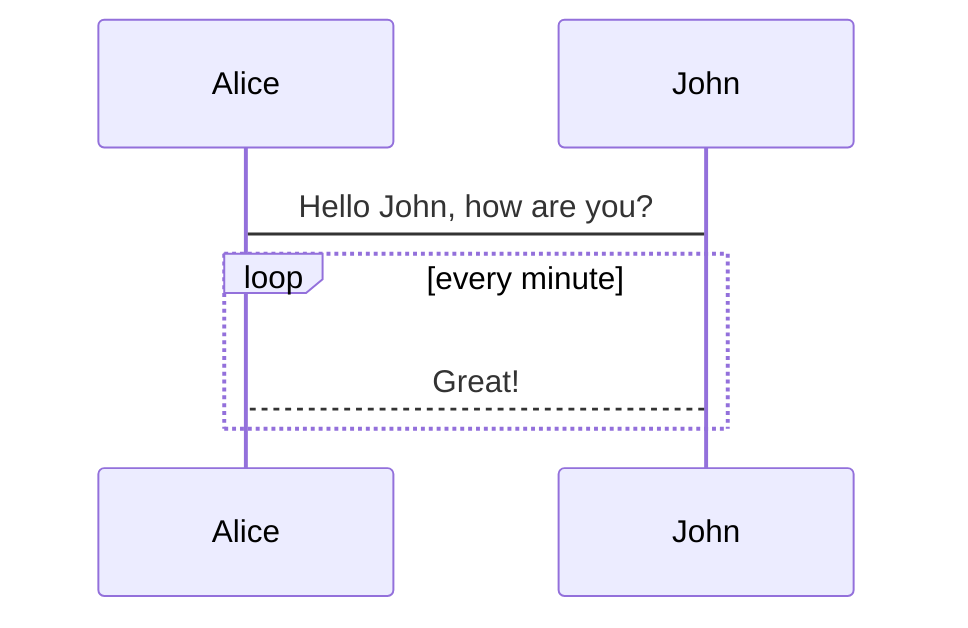
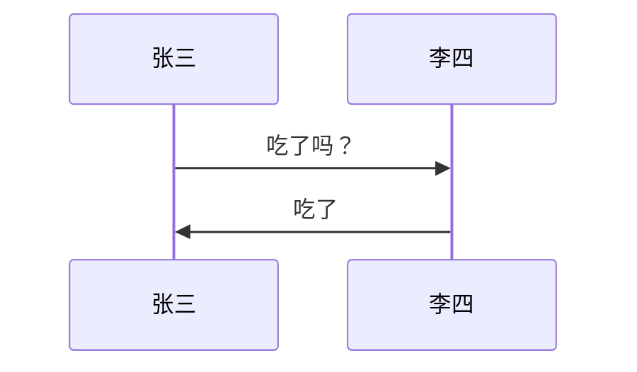
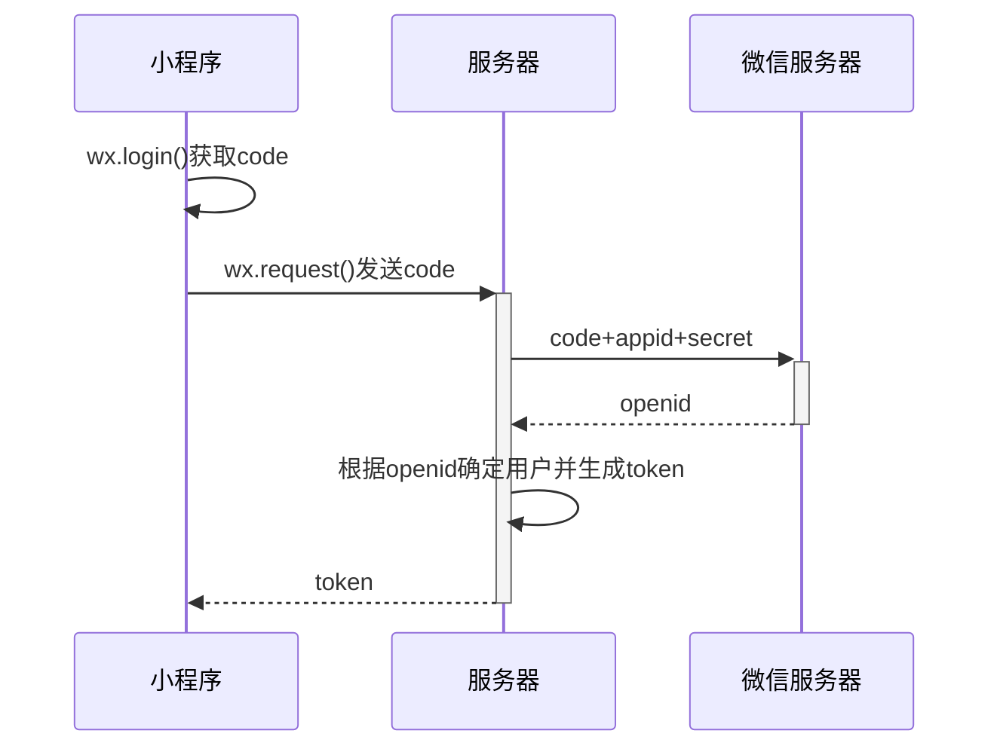
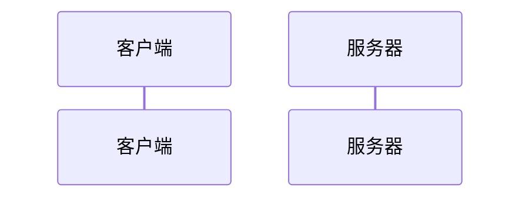
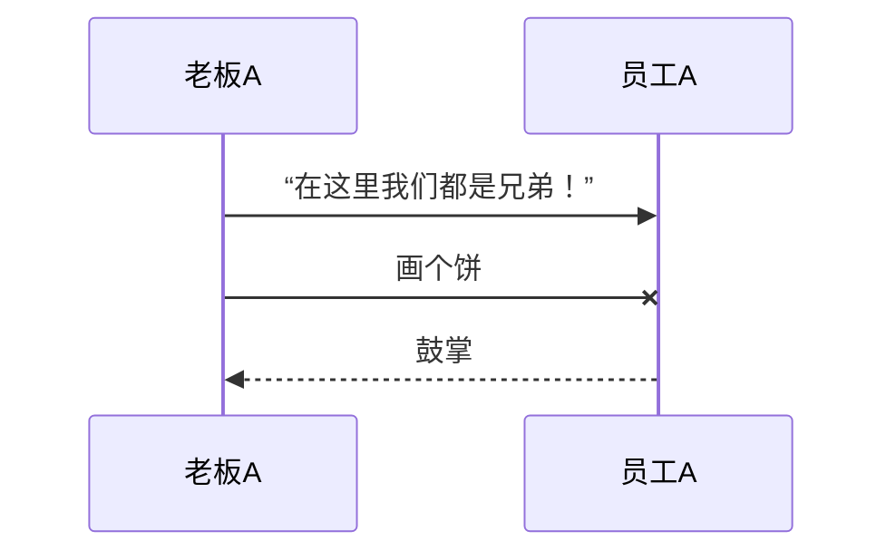

# 时序图 sequenceDiagram

时序图(Sequence Diagram)，又名序列图、循序图，是一种 UML 交互图。它通过描述对象之间发送消息的时间顺序显示多个对象之间的动态协作。

## 序列图 sequenceDiagram

## 时序图 小程序

登陆过程中，小程序、服务器、微信服务器三者交互的时序图：

### 参与者 participant

传统时序图概念中参与者有角色和类对象之分，但这里我们不做此区分，用参与者表示一切参与交互的事物，可以是人、类对象、系统等形式。中间竖直的线段从上至下表示时间的流逝。

| 属性            | 说明                                                    |
| --------------- | ------------------------------------------------------- |
| sequenceDiagram | 为每幅时序图的固定开头                                  |
| participant     | <参与者名称> 声明参与者，语句次序即为参与者横向排列次序 |

### 消息

交互时一方对另一方的操作（比如接口调用）或传递出的信息。用单向箭头来表示——实线代表主动发出消息；虚线代表响应；末尾带「X」代表异步消息，无需等待回应。

::: tip
消息语句格式为：<参与者> <箭头> <参与者> : <描述文本>。
其中 <箭头>的写法有：
->> 显示为实线箭头（主动发出消息）
-->>显示为虚线箭头（响应）
-x 显示为末尾带「X」的实线箭头（异步消息）
:::
